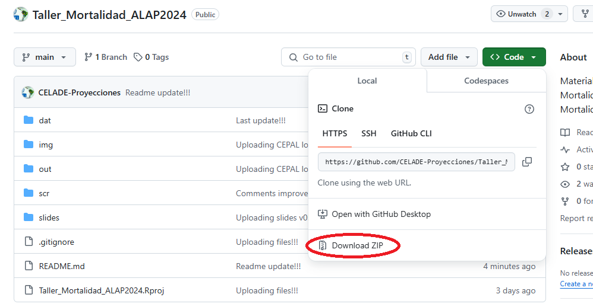
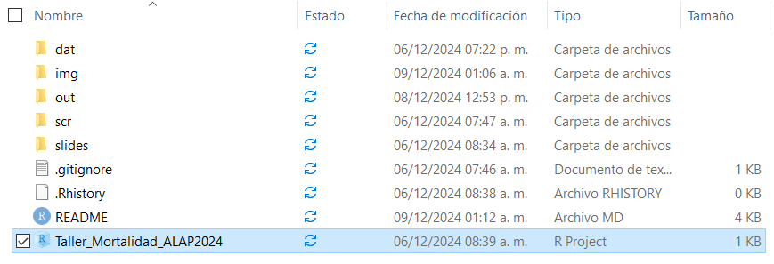
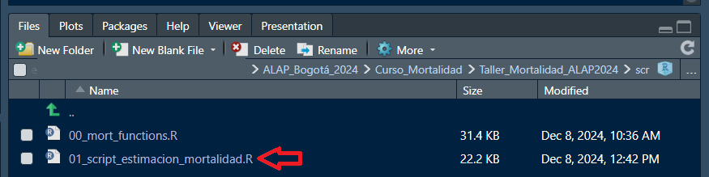
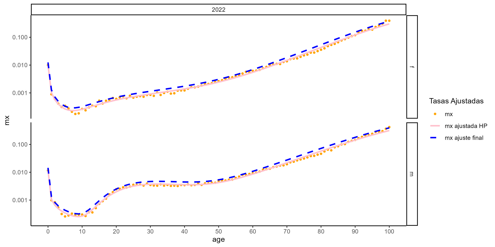
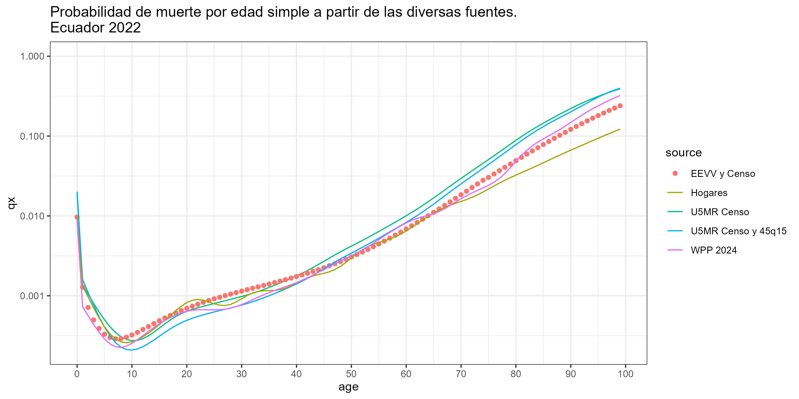

# Introducción a la evaluación, ajuste y análisis de datos de mortalidad en el contexto latinoamericano


Repositorio del "Taller de estimación de la mortalidad en América Latina fuentes de datos y métodos" de la Escuela de Salud y Mortalidad de ALAP 2024 

### Centro Latinoamericano y Caribeño de Demografía (CELADE) - División de Población de la CEPAL
### Pre-evento del XI Congreso ALAP; Bogotá, Colombia
### 9 de diciembre de 2024 

### Facilitadora: Helena Cruz Castanheira
[helena.cruz@cepal.org](mailto:helena.cruz@cepal.org)

## Estructura de repositorio
* `dat` : datos de entrada
* `scr` : código para replicar el análisis y las visualizaciones
* `slides` : presentación del taller
* `out` : resultados


- [Primera parte: La estimación de la mortalidad en América Latina fuentes de datos y métodos](#primera-parte-la-estimación-de-la-mortalidad-en-américa-latina-fuentes-de-datos-y-métodos)
- [Segunda parte: Estimación de tablas de mortalidad con R a partir de varias fuentes](#Segunda-parte-Estimación-de-tablas-de-mortalidad-con-R-a-partir-de-varias-fuentes)
  - [TM a partir de la mortalidad en la niñez de censos (U5MR) y tablas modelo](#TM-a-partir-de-la-mortalidad-en-la-niñez-de-censos-U5MR-y-tablas-modelo)
  - [TM a través de las defunciones del hogar de censos](#TM-a-través-de-las-defunciones-del-hogar-de-censos)
  - [TM a partir de los registros vitales y censos](#TM-a-partir-de-los-registros-vitales-y-censos)
  - [TM a través de dos parámetros: mortalidad en la niñez y adulta (45q15)](#TM-a-través-de-dos-parámetros-mortalidad-en-la-niñez-y-adulta-45q15)
  - [Análisis comparativo de los distintos métodos](#Análisis-comparativo-de-los-distintos métodos)
 
# Primera parte: La estimación de la mortalidad en América Latina fuentes de datos y métodos

Las diapositivas para la primera parte del taller están disponibles
[aquí](slides/ALAP_AnálisisMortalidad_v0.pdf).


# Segunda parte: Estimación de tablas de mortalidad con R a partir de varias fuentes

A continuación se estiman las tablas de mortalidad de Ecuador para el 2022 a partir de
varias fuentes de información.  Una de las principales fuentes es el Censo
Ecuador 2022 que tiene como fecha de referencia el `30-11-2022`.
Para más detalles: https://www.censoecuador.gob.ec/

Antes de arrancar el taller práctico se recomienda descargar el repositorio de `github`:



Cuando la carpeta se encuentre en su PC descomprímala, ingrese a dicha carpeta y pique en el ícono del proyecto:



Luego vaya a `Files`, `scr` e ingrese al archivo R `01_script_estimacion_mortalidad`:  



Una vez ahí asegúrese de tener instalados los siguientes paquetes de `R` para a continuación cargarlos:

``` r
library(data.table)
library(dplyr)
library(u5mr)
library(DemoTools)
library(DemoToolsData)
library(MortalityLaws)
library(ggplot2)
library(dplyr)
```

> *Nota:* si algún paquete no está instalado en su computadora, instálelo
> usando el comando `install.packages("dplyr")`.  En el caso del `DemoTools`:

``` r
# install.packages("remotes")

# requires the development version of rstan
install.packages("rstan", repos = c("https://mc-stan.org/r-packages/", getOption("repos")))
remotes::install_github("timriffe/DemoTools")
```

## TM a partir de la mortalidad en la niñez de censos U5MR y tablas modelo

En esta parte se estima la tabla de vida para mujeres a través de un sólo parámetro `mortalidad en la niñez` del censo (U5MR) y la tabla CD West.

Para ello primero se calcula de manera indirecta la _U5MR_ (véase [Indirect Estimation Child Mortality IUSSP](https://demographicestimation.iussp.org/content/indirect-estimation-child-mortality)):

``` r
ecu_nac22_qx_iussp <- u5mr_trussell_adj(
  cmr_data,
  women = "women",
  child_born = "child_born",
  child_dead = "child_dead",
  agegrp = "agegrp",
  model = "west",
  svy_year = 2022+10/12+30/365,
  sex = "both",
  variant = "iussp",
  e_0 = 70
)
```

Y luego la tabla de vida de mujeres con la función `lt_model_cdun_match_single` (antes MATCH del [MORTPAK](https://www.un.org/development/desa/pd/content/mortpak-UN-software-package-mortality-measurement)).

``` r
lt_Ec_oneP <- lt_model_cdun_match_single(type = "CD_West", 
                                 Sex = "f", 
                                 indicator = "5q0", 
                                 value = q05,
                                 OAnew = 100)
```


## TM a través de las defunciones del hogar de censos

Aquí se calcula las tablas de mortalidad con el [módulo de mortalidad de hogares](https://www.censoecuador.gob.ec/data-censo-ecuador/) del Censo Ecuador 2022 y la población trasladada a mitad de período (proxy de los años-persona vividos).

Por la mala declaración de edad de las defunciones en el censo las tablas se calculan inicialmente por edad quinquenal y luego se abren a edad simple haciendo uso de varias funciones de [DemoTools](https://timriffe.github.io/DemoTools/).

``` r
## 2.5 Construción tabla de mortalidad x edad simple----
single_est <- TRUE # TRUE para edad simple o FALSE para grupos quinquenales

### Cálculo tasas de mortalidad corregidas por completitud
lt_input_2022h[ , mx := (deaths / pop_exp) / vr_comp_new]

### Tabla mortalidad nacional por edad simple para ambos sexos
lt_output_2022h <- data.table()
for( s in c( 'm', 'f' ) ){
  for( y in unique( lt_input_2022h$date_ref ) ){
    
    temp_dt <- lt_input_2022h[ sex == s & date_ref == y ]
    
    # utiliza datos de igme para ajustar las tasas de mortalidad < 1 y 1-4
    q0_1 <- unique( temp_dt$q1 ) / 1000
    q0_5 <- unique( temp_dt$q5 ) / 1000
    q1_4 <- 1 - ( 1 - q0_5 ) / ( 1 - q0_1 )
    
    new_a0_1 <- DemoTools::lt_rule_1a0_ak( q0 = q0_1, Sex = s )
    new_m0_1 <- q0_1 / ( 1 - ( 1 - new_a0_1 ) * q0_1 )
    new_a1_4 <- DemoTools::lt_rule_4a1_cd( M0 = new_m0_1, Sex = s, region = "w" )
    new_m1_4 <- q1_4 / ( 4 - ( 4 - new_a1_4 ) * q1_4 )
    temp_dt[ age5 == 0 ]$mx <- new_m0_1
    temp_dt[ age5 == 1 ]$mx <- new_m1_4
    
    temp_lt <-
      lt_ambiguous(
        nMx_or_nqx_or_lx = temp_dt$mx,
        type = "mx",
        Age = temp_dt$age5,
        Sex = s,
        a0rule = "cd", 
        region = "w",
        axmethod = "un",
        extrapLaw = 'Kannisto',
        extrapFrom = 75,
        extrapFit  = temp_dt[ age5 %in% 60:70 ]$age5,
        OAG = TRUE,
        OAnew = 100,
        radix = 1,
        Single = single_est ) %>%
      setDT %>%
      .[ , date_ref := y ] %>%
      .[ , sex := s ]
    
    lt_output_2022h <- 
      rbind(
        lt_output_2022h,
        temp_lt[ , .( lt_desc = 'TABMORT Mortalidad de Hogares del Censo 2022',
                      year = trunc( y ),
                      date_ref, 
                      sex,
                      age = Age, 
                      mx = round( nMx, 6 ), 
                      qx = round( nqx, 6 ),
                      ax = round( nAx, 6 ), 
                      lx = round( lx, 6 ), 
                      dx = round( ndx, 6 ), 
                      Lx = round( nLx, 6 ), 
                      Sx = round( Sx, 6 ),
                      Tx = round( Tx, 6 ), 
                      ex = round( ex, 6 ) ) ]
      )
    
  }
  
}
```

## TM a partir de los registros vitales y censos

En esta sección se estima las tablas de mortalidad por edad simple con la información de las estadísticas vitales ([defunciones](https://www.ecuadorencifras.gob.ec/defunciones-generales/)) y censo (población a mitad de año).  Se usa la mortalidad infantil estimada por la Revisión 2024 de las [estimaciones-proyecciones de población](https://www.ecuadorencifras.gob.ec/proyecciones-poblacionales/) del INEC Ecuador. 

Las tasas de mortalidad se suavizan con [Helligman y Pollard (1980)](https://doi.org/10.1017/S0020268100040257) y son ajustadas por completitud a través de estimaciones derivadas del [WPP](https://population.un.org/wpp/).




## TM a través de dos parámetros: mortalidad en la niñez y adulta 45q15

Con el fin de evaluar otra de las posibles opciones al momento de estimar tablas de mortalidad se presenta la opción de estimar la tabla de mortalidad de mujeres a través de dos parámetros mortalidad en la niñez y adulta con la función `lt_model_cdun_combin_single` (antes COMBIN del [MORTPAK](https://www.un.org/development/desa/pd/content/mortpak-UN-software-package-mortality-measurement))

``` r
## 4.2 Tabla de vida a partir de la mortalidad en la niñez y adulta----
lt_Ec_twoP <- lt_model_cdun_combin_single(type = "CD_West", 
                                                   Sex = "f", 
                                                   q1 = NA, 
                                                   q5 = q05, 
                                                   indicator_adult = "45q15", 
                                                   value_adult = q15_45, 
                                          OAnew = 100)
```

## Análisis comparativo de los distintos métodos

> Al final se comparan los resultados de todos los posibles métodos presentados en este corto taller.


